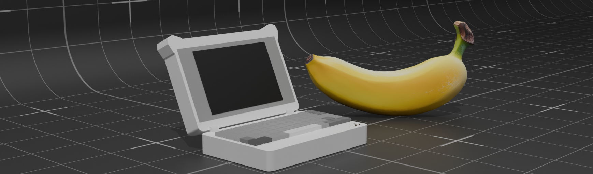

# ittyPDA


hi! this is my little thing im working on.

ittyPDA is an itty-bitty PDA/cyberdeck thingy. its smaller than a nintendo ds but has a real keyboard and a full color IPS LCD display.

it's mainly intended for note-taking/writing, playing silly little videogames, and just being a very hackable little computer.

## specs & parts

* microprocessor: [STM32F401RET6](https://www.st.com/en/microcontrollers-microprocessors/stm32f401re.html)
    * 84 MHz
    * 512 Kb flash
    * 96 Kb RAM
* display: [3.5" IPS display (no touch version)](https://www.lcdwiki.com/3.5inch_IPS_SPI_Module_ST7796)
* storage: SD card slot included on display
* charging/data transfer over USB-C
* battery: 2200mAh LiPo - [this is the one I use, but really any battery with a similar size and connector will work](https://www.amazon.se/-/en/gp/product/B0D7VT93JX?smid=A2YUU8D7JQVZCY&th=1)
* on-board charging circuitry powered by a [BQ24040DSQR](https://www.ti.com/product/BQ24040)


## download symbols/footprints

to open the kicad project, youll need to download some footprints. my parts are sourced from JLCPCB's parts / LCSC, and you can use [`easyeda2kicad`](https://github.com/uPesy/easyeda2kicad.py) to download LCSC parts to kicad.

the command you need to run is: 

```bash
easyeda2kicad --full --lcsc_id C318884 C191023 C22435642 C13738 C81080 C49023767 C19273152
```

which will download footprints/symbols/3d models for the switches, diodes, etc.

<hr>

<sup>made with <3</sup>