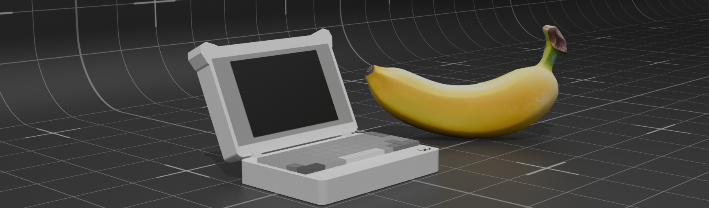
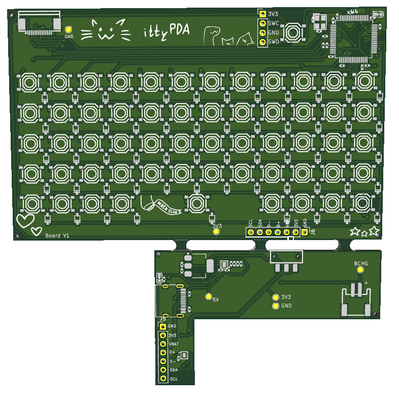
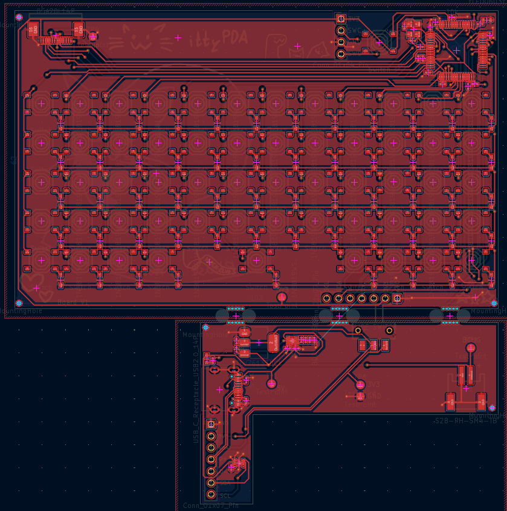
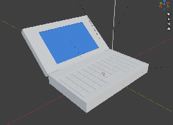
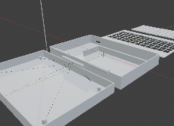

# ittyPDA


hi! this is my little thing im working on.

ittyPDA is an itty-bitty PDA/cyberdeck thingy. its smaller than a nintendo ds but has a real keyboard and a full color IPS LCD display, power by an STM32 microcontroller.

it's mainly intended for note-taking/writing, playing silly little videogames, and just being a very hackable little computer.

this repo contains both the hardware designs, under the `ittypda/` subdirectory, as well as the operating system under `ittyOS/`. 3D case files are under `case/`.

## specs & parts

* microprocessor: [STM32F411RET6](https://www.st.com/en/microcontrollers-microprocessors/stm32f411re.html)
    * Up to 100 MHz
    * 512 Kb flash
    * 128 Kb RAM
* display: [3.5" IPS display (no touch version)](https://www.lcdwiki.com/3.5inch_IPS_SPI_Module_ST7796)
* storage: SD card slot included on display
* charging/data transfer possible over USB-C
* battery: 2200mAh LiPo - [this is the one I use, but really any battery with a similar size and connector will work](https://www.amazon.se/-/en/gp/product/B0D7VT93JX?smid=A2YUU8D7JQVZCY&th=1)
* on-board charging circuitry powered by a [BQ24040DSQR](https://www.ti.com/product/BQ24040)
    * also battery level sensing


## download symbols/footprints

to open the kicad project, youll need to download some footprints. my parts are sourced from JLCPCB's parts / LCSC, and you can use [`easyeda2kicad`](https://github.com/uPesy/easyeda2kicad.py) to download LCSC parts to kicad.

the command you need to run is: 

```bash
easyeda2kicad --full --lcsc_id C318884 C191023 C22435642 C13738 C81080 C49023767 C19273152 C165948 C295747 C20416998 C2682616
```

which will download footprints/symbols/3d models for the switches, diodes, etc.

## project status (important !!)

project is in a very early WIP state currently! the PCB is the only truly *finished* part so far.

the case is just a minimum-viable-product for now, and the firmware mostly acts as a proof-of-concept regarding graphics streaming and input handling from the keyboard matrix.

thus the project is mostly about the creation of the PCB, with the case and firmware mostly just acting as beta features used to test the PCB itself.

these features will be developed in the coming months though, and when i have guaranteed that the core PCB does work! this is a project i intend to gradually work on for a long time !

## schematic / PCB

the schematic and PCB are designed in KiCad, files for which are found in `ittypda/`.

the PCB is split in two seperate parts. this is done to achieve a budget 4-layer board, and to get around the fact that JLCPCB's economy PCBA service cant assemble parts on the bottomside of the board.

the mainboard houses the microcontroller, the keypad, and display connector.

the secondary board houses the usb-c port, battery charging ic, voltage regulator, etc.

the two boards mount together like a PCB-sandwich and connect through 7 soldered pads.


## firmware - ittyOS

ittyOS is currently in an early proof of concept state, but will have many different apps later on.


implemented:
* display drivers
* reading from microSD card
* streaming image data from microSD to screen
* input from keyboard
* program switching
* basic home screen
* basic notes app

todo:
* improve text input
* usb file transfer
* more apps!
    * wordle
    * journal
* different themes?

### compile ittyOS

the `../firmware` folder contains the low level hardware setup for different boards that can run ittyOS, while `ittyOS/` contains the shared code and the actual system, which is then linked to from the firmware.

you'll need to generate the firmware code from the STM32 project file, since the low-level drivers for these boards are very large and therefore gitignored. you'll need STM32CubeMX. then just open the project file for the firmware you want to build, and hit generate code. 

you'll also have to tell your LSP which CMakeLists you're using.

then, to build, navigate to the firmware you want to build's directory.

1. `cmake --preset Debug` (you only have to run this once)
2. `cmake --build --preset Debug`
3. `STM32_Programmer_CLI -c port=swd -w build/Debug/<DEVBOARD OR ITTYPDA HERE>.elf -v -rst`

## case

the case files are located under `case/`.

the case is designed in,.. blender. its mostly a MVP for a case, and when i phyiscal PCB this and the firmware will be the major focus for the project moving forwards.

most parts are designed to friction-fit, though i wont know how well this works in practice, but will find out soon !


<hr>

<sup>made with <3</sup>
